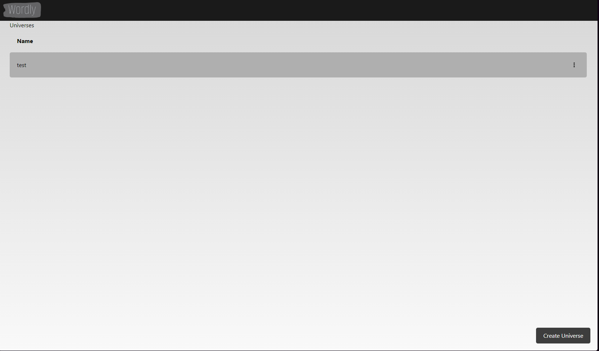
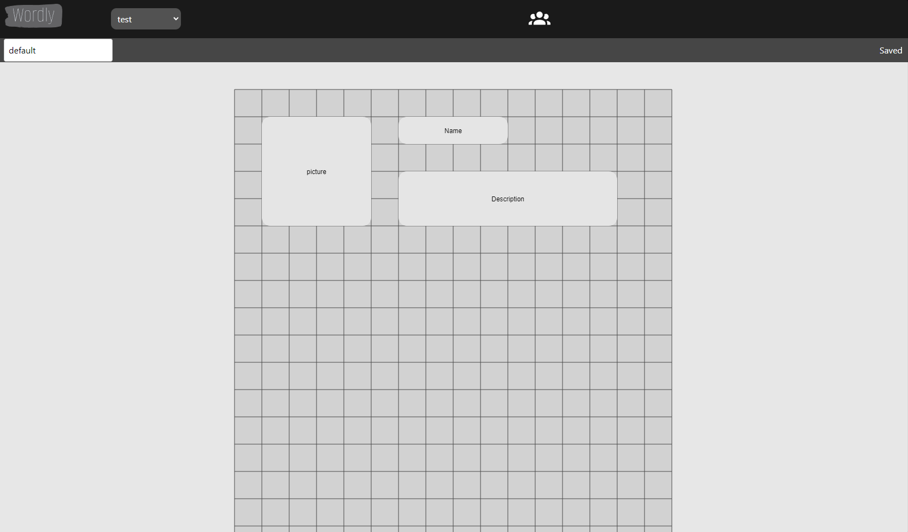

# Wordly

Wordly is a web application where users can create and share their own worlds.

Create a world, add charactrers, map, species, and more.
Share your world with others, print your characters sheets and have your own wiki.

(Wordly is still in early development, and is not yet ready for usage.)

## Screenshots

## Installation

### with pnpm

1. Clone the repository
2. Install pnpm with `npm install -g pnpm`
3. Install the dependencies with `pnpm install`
4. Install [mongodb](https://www.mongodb.com/)
5. Install [minio](https://min.io/)
6. Install a [supabase instance](https://supabase.io/)
7. Create a [Google Cloud oauth2 credentials](https://console.cloud.google.com/apis/credentials/) (for deployment)
8. Copy the `.env.example` file to `.env` and fill in the required values :
    - `AUTH_SECRET`: a random base64 string
    - `GOOGLE_ID`: the client id of your Google Cloud oauth2 credentials (for deployment)
    - `GOOGLE_SECRET`: the client secret of your Google Cloud oauth2 credentials (for deployment)
    - `MINIO_ACCESS_KEY`: the access key of your minio instance
    - `MINIO_SECRET_KEY`: the secret key of your minio instance
    - `FORCE_LOGIN` : `true` to force login and access to the app without oauth2 services (for local development)
    - `PROFILE_ID` : the id of the profile in the supabase instance (for local development)
9. Run the app with `pnpm dev`

### with docker-compose

1. Clone the repository
2. Install [docker-compose](https://docs.docker.com/compose/install/)
3. Create a [Google Cloud oauth2 credentials](https://console.cloud.google.com/apis/credentials/) (for deployment)
4. Copy the `.env.example` file to `.env` and fill in the required values :
    - `AUTH_SECRET`: a random base64 string
    - `GOOGLE_ID`: the client id of your Google Cloud oauth2 credentials (for deployment)
    - `GOOGLE_SECRET`: the client secret of your Google Cloud oauth2 credentials (for deployment)
    - `MINIO_ACCESS_KEY`: the access key of your minio instance
    - `MINIO_SECRET_KEY`: the secret key of your minio instance
    - `FORCE_LOGIN` : `true` to force login and access to the app without oauth2 services (for local development)
    - `PROFILE_ID` : the id of the profile in the supabase instance (for local development)
5. Run the app with `docker-compose up -d` or `docker-compose up -d --build` if you want to rebuild the images (for deployment)

* The app will be available at `http://localhost:3000`

## Usage

Checkout our user guide (coming soon)

## Support

If you have any questions or issues, please open an issue on the repository.

## Roadmap

Our roadmap is available on (coming soon)

## Contributing

If you want to contribute, please open a pull request on the repository.
Technical documentation will be available soon.

## Authors and acknowledgment

- [Pebloop](https://github.com/Pebloop) : Owner and main developer

## License

This project is licensed under the MIT License - see the [LICENSE](LICENSE) file for details